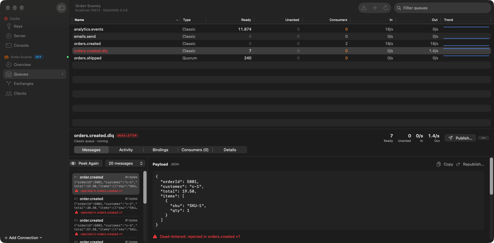
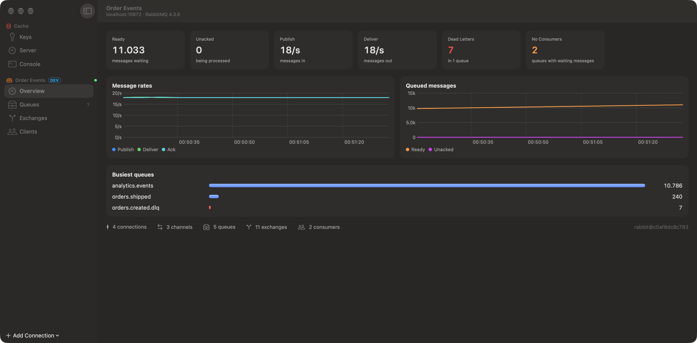
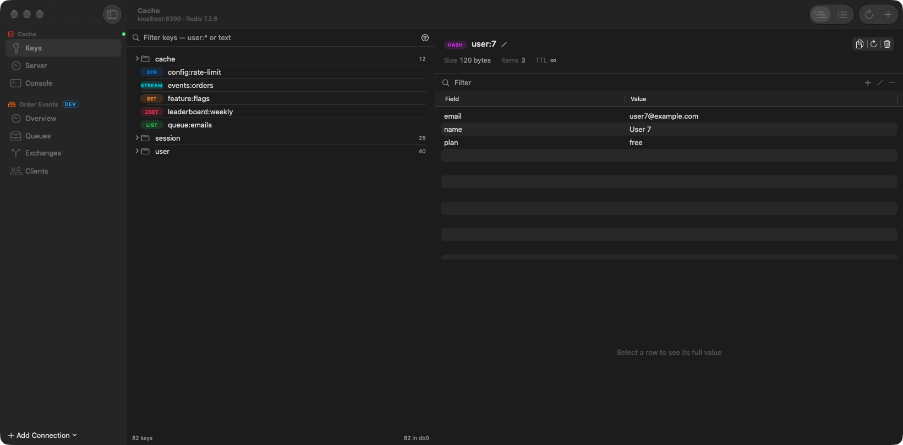
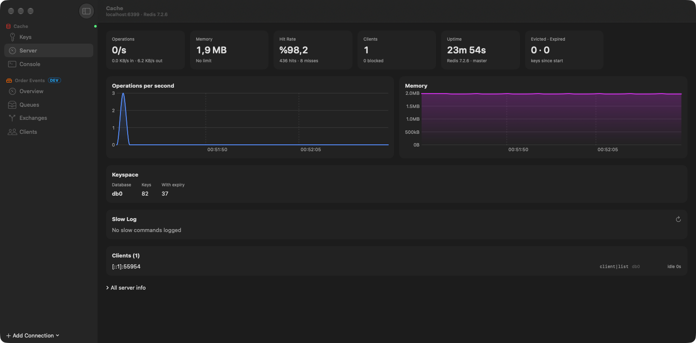

<p align="center">
  
</p>

<h1 align="center">Spool</h1>

<p align="center">
  <b>A native Mac client for Redis and RabbitMQ — browse keys, peek at messages, and fix what's stuck.</b>
</p>

<p align="center">
  
  
  
</p>

<p align="center">
  
</p>

---

Backend work means living with caches and message brokers. Their built-in tools are a CLI and a web page from 2012. Spool puts both in one fast, keyboard-friendly Mac app that looks like it belongs on your Mac — sidebar, tables, Liquid Glass, light and dark mode.

## RabbitMQ

- **Queues at a glance** — ready, unacked, consumers, in/out rates and a trend line for every queue, sortable and filterable. Dead-letter queues with messages turn red; queues with messages and no consumers turn orange.
- **Peek at messages safely** — see payloads (JSON formatted), properties and headers without losing anything; peeked messages go straight back to the queue.
- **Understand dead letters** — Spool reads `x-death` and shows why a message was rejected, where it came from, and lets you **republish it to its original exchange and routing key** in one click.
- **Move messages** from a DLQ back to its queue. Spool uses a one-off shovel, so each message is removed from the source only after the target has it.
- **Publish** with headers, content type and repeat count; **purge**, **create** and **delete** queues; **bind** queues and see an exchange's routing map.
- **Live overview** — message rates, queue depth, busiest queues, connections and consumers.
- **Watch queues from the menu bar** and get a notification when one grows past your limit.

<p align="center">
  
</p>

## Redis

- **Key browser** that groups `user:42:profile`-style keys into folders, with type, TTL and size for every key. Filter by pattern or type; scanning uses `SCAN`, never `KEYS`.
- **Edit every type** — strings (with JSON formatting that never changes your numbers or key order), hashes, lists, sets, sorted sets and streams.
- **TTL, rename and delete** in place; deleting keys, purging and deleting queues always ask first.
- **Server dashboard** — ops/sec and memory charts, hit rate, keyspace, slow log and clients.
- **Console** with history, quoted arguments and redis-cli–style output.

<p align="center">
  
</p>

## Built with care

- **Swift 6 and SwiftUI**, no web views and no dependencies.
- **Its own Redis client** — a pipelined RESP implementation on Network.framework, so hundreds of commands can be in flight at once.
- **The RabbitMQ management API** over URLSession, decoded so that queue arguments and message headers keep their exact keys.
- **Sandboxed**, with passwords in the Keychain. Connections can be labelled *dev*, *staging* or *prod* so you always know where you are.
- **Tested against real servers** — `SpoolKit` has unit tests and live tests for Redis and RabbitMQ.

<p align="center">
  
</p>

## Build and run

Requires Xcode 26 and macOS 26.

```bash
git clone https://github.com/anilipeksumer/Spool.git
cd Spool
brew install xcodegen   # the Xcode project is generated from project.yml
xcodegen generate
open Spool.xcodeproj
```

To try it without real servers:

```bash
docker run -d -p 6379:6379 redis:7
docker run -d -p 5672:5672 -p 15672:15672 rabbitmq:4-management
```

Then add *Local Redis* (`localhost:6379`) and *Local RabbitMQ* (`localhost:15672`, guest/guest) in Spool.

### Tests

```bash
cd Packages/SpoolKit
swift test
```

The live tests run when a Redis server is on port `6399` (or `SPOOL_TEST_REDIS_PORT`) and RabbitMQ's management API is on `localhost:15672`; otherwise they're skipped. Moving messages needs the shovel plugins: `rabbitmq-plugins enable rabbitmq_shovel rabbitmq_shovel_management`.

## Project layout

| Path | What it is |
| --- | --- |
| `Packages/SpoolKit` | Redis (RESP) and RabbitMQ clients, models and tests. No UI. |
| `Spool/Model` | Saved connections, live sessions, menu bar watches. |
| `Spool/Views` | The SwiftUI app. |

## License

MIT — see [LICENSE](LICENSE).
